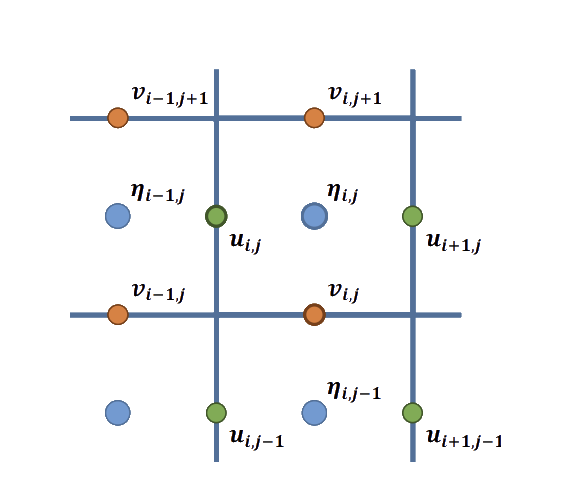

# Shallow Equations Solver

This project implements a solver for shallow water equations using the finite difference method. The code is optimized with OpenMP for single-machine parallelism and MPI for distributed computing.

## Shallow Water Equations

The shallow water equations solved in this project are:

$$
\frac{\partial \eta}{\partial t} = -\nabla \cdot (h\mathbf{u})
$$

$$
\frac{\partial \mathbf{u}}{\partial t} = -g\nabla \eta - \gamma\mathbf{u}
$$

Where:
- $\eta$ is the water elevation
- $\mathbf{u}$ is the depth-averaged velocity vector
- $h$ is the water depth
- $g$ is the gravitational acceleration
- $\gamma$ is a friction coefficient

## Numerical Scheme

The solver uses a diamond scheme for spatial discretization and an explicit Euler scheme for time integration.

### Spatial Discretization

The diamond scheme is employed for spatial discretization. In this scheme:
- The elevation $\eta$ is computed at the center of the cells
- The components of the depth-averaged velocity ($u$ and $v$) are computed on the boundaries of the cells



Figure 1: Diamond scheme for spatial discretization.

### Temporal Discretization

Using an explicit Euler scheme, the discretized equations are as follows:

$$
\frac{\eta_{i,j}^{n+1} - \eta_{i,j}^n}{\Delta t} = -\frac{h(\mathbf{x}^{u_{i+1,j}})u_{i+1,j}^n - h(\mathbf{x}^{u_{i,j}})u_{i,j}^n}{\Delta x} - \frac{h(\mathbf{x}^{v_{i,j+1}})v_{i,j+1}^n - h(\mathbf{x}^{v_{i,j}})v_{i,j}^n}{\Delta y}
$$

$$
\frac{u_{i,j}^{n+1} - u_{i,j}^n}{\Delta t} = -g\frac{\eta_{i,j}^{n+1} - \eta_{i-1,j}^{n+1}}{\Delta x} - \gamma u_{i,j}^n
$$

$$
\frac{v_{i,j}^{n+1} - v_{i,j}^n}{\Delta t} = -g\frac{\eta_{i,j}^{n+1} - \eta_{i,j-1}^{n+1}}{\Delta y} - \gamma v_{i,j}^n
$$

Where $\mathbf{x}^{u_{i,j}}$ and $\mathbf{x}^{v_{i,j}}$ are the locations of the $u$ and $v$ components of the velocity, respectively:

$$
\mathbf{x}^{u_{i,j}} := (x_a + i\Delta x, y_a + (j + \frac{1}{2})\Delta y)
$$

$$
\mathbf{x}^{v_{i,j}} := (x_a + (i + \frac{1}{2})\Delta x, y_a + j\Delta y)
$$

Note: Using implicit Euler instead would lead to evaluating all the velocities ($u$ and $v$) at step $n+1$ instead of $n$ in the right-hand-sides of the first three equations.

## Features

- Solves shallow water equations using finite differences
- Optimized with OpenMP for CPU parallelism
- Utilizes MPI for distributed computing

## Prerequisites

- A compatible C compiler (e.g., GCC)
- OpenMP
- MPI 

## Compilation

### On Windows

1. Ensure Microsoft MPI is installed and environment variables are properly configured.

2. Use the `set_MPI.bat` script to compile the code:

   ```
   ./set_MPI.bat shallow_MPI_exe shallow_MPI.c tools_MPI.c
   ```

   The content of the `set_MPI.bat` file is as follows:

   ```batch
   @echo off
    REM Assurez-vous que ces chemins correspondent à votre installation
    set MSMPI_INC="C:\Program Files (x86)\Microsoft SDKs\MPI\Include"
    set MSMPI_LIB64="C:\Program Files (x86)\Microsoft SDKs\MPI\Lib\x64"

    REM Compilation avec gcc, incluant les options d'optimisation et OpenMP
    gcc -O3 -fopenmp -I%MSMPI_INC% -L%MSMPI_LIB64% -o %1 %2 %3 -lmsmpi -lm

    REM use 'mpiexec -n <nombre_de_processus> %1' pour exécuter.
   ```

## Execution

To run the program with MPI on Windows, use the following command:

```
mpiexec -n 4 .\shallow_MPI_exe.exe
```

Replace `4` with the number of processes you want to use.

### On Linux

TO DO
